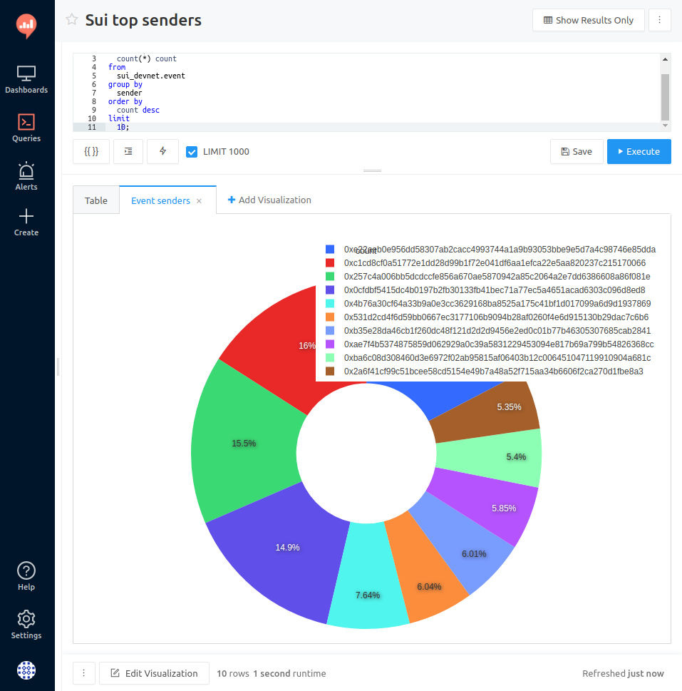
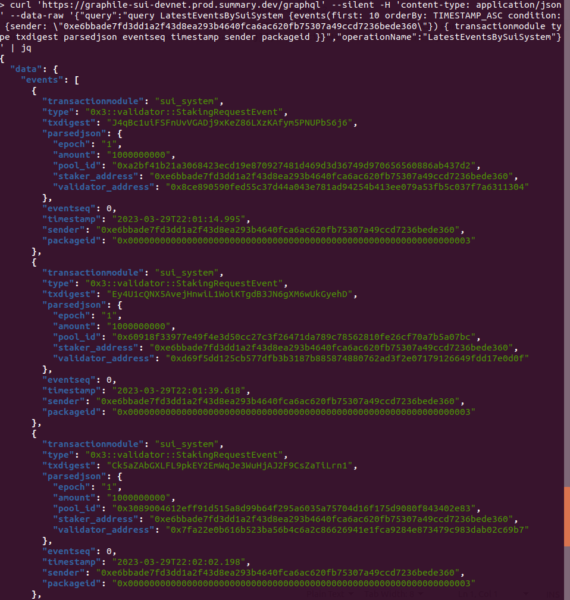

# Sui Data Tool

Indexes Sui data and lets developers and analysts explore it with SQL
and GraphQL queries.

## Why we developed it

This is a platform tool that indexes all events and provides access to
blockchain data with the power and flexibility of SQL. Rather than
having each team develop their own indexer, one platform for all saves
effort. It also helps discover data from other projects and lets
users share their findings.

Access to raw data is free, as well as to the results of the users'
research: queries and dashboards can be shared and forked, helping
spread the knowledge and build the community.

## SQL Editor

Blockchain data can be accessed via popular Business Intelligence tools
like [Redash](https://redash.io/) with a full featured SQL Editor.

Queries can be published and become available to other users to execute and fork.

Try it out: https://redash.prod.summary.dev


## Query via API

Access query results via an http call by your script or app. Your query
is protected by an API key.

```bash
curl https://redash.prod.summary.dev/api/queries/5/results.json?api_key=\
iXokC38mDQD0nMiID1ZBIBenvVFVcPc3Bt9X0nYz
```


## Query results from the API

Response comes in json or csv which you can parse to automate your data
pipeline.


## Charts

Build charts from the results of you query.



## Dashboards

Build dashboards with charts and embed them into your own web pages.

Try it out https://redash.prod.summary.dev/public/dashboards/2D97eoBvXCnlmsZHCh948MiAbU30VsYdWW1xnLIt


## GraphQL

Query blockchain data with GraphQL from a web interface.

Compare to SQL this interface is better suited for data exploration and automation.


## GraphQL response

Comes in json.


## GraphQL via http

GraphQL queries can be sent via an http post by your script or app.

```bash
curl 'https://graphile-sui-devnet.prod.summary.dev/graphql' 
-H 'content-type: application/json' 
--data-raw '{"query":"query LatestEventsBySuiSystem 
{events(first: 10 orderBy: TIMESTAMP_ASC condition: 
{sender: \"0xe6bbade7fd3dd1a2f43d8ea293b4640fca6ac620fb75307a49ccd7236bede360\"}) 
{ transactionmodule type txdigest parsedjson eventseq timestamp sender packageid }}"}'
```


 


